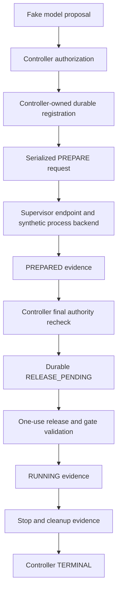

# Controller/supervisor composition — incomplete, not deployable

The composition changes in the working tree are **not a provisioning checkpoint**.
No installed entrypoint, service, socket, account or installation bundle is enabled
by these changes. The existing provisioning validator and templates are unchanged.

## Implemented offline path

`composition.ControllerRuntime` keeps the registry and the existing final-authority
sequencer in the controller process. `RemoteProcessBackend` serializes only logical
plan/execution/launch IDs, binding digests and bounded deadlines. The separate
`SupervisorEndpoint` owns fixed plans and process-backend state; it receives no
registry object and does not write controller SQLite.

`composition_protocol.FrameReader` incrementally validates one bounded frame and
requires EOF before dispatch. The wire schema rejects privileged launch parameters,
unknown fields, duplicate keys, invalid UTF-8, oversized frames and stale correlation
identities. `EnrolledChannel` supplies a kernel-peer/process verification primitive;
the offline transport is not an authenticated installed Unix transport.

The controller requests exclusive admission inside `RuntimeRegistry.register_launch`
so unresolved attempts cannot overlap across workers. Authority replacement, expired
deadlines and failed release acknowledgements retain the existing fail-closed
sequencing. The supervisor consumes a release before attempting delivery and does
not retry it. A fixed-payload digest prevents a selected installed plan from executing
a different command than the one the controller authorized.

`integration_policy.IntegrationPolicy` records the requested immutable integration
limits, including ephemeral 128 MiB / 16384-inode workspace storage and separate
16 MiB HOME/TMP. It is a policy record, **not proof that all limits are wired into
the Linux backend**. Its supervisor capability allowlist includes read-only DAC
inspection; controller and worker allowlists remain empty. This separate policy has
not replaced the existing installation-manifest validator.

## Still required before the requested checkpoint can be committed

1. Installed controller and supervisor entrypoints, strict operational-configuration
   loading, existing-registry owner/integrity validation and startup composition.
2. Authenticated nonblocking Unix transport/event loops, independently serviced
   heartbeat, cancellation and deadline paths, and READY/watchdog integration.
   Calling `tick()` explicitly in a synthetic test is not an installed watchdog.
3. Supervisor-only inspection and retained pinned-export handoff. The controller's
   current authorization store still uses a TaskRoot-like object. The offline full
   lifecycle test uses a synthetic root; it does not prove that UID 3000 can authorize
   worker-owned 0700 exports without reading them itself. ApprovedPlan identities
   must be verified by that real handoff, not merely echoed from configuration.
4. Unsolicited completion/cleanup evidence, reconnect enrollment and installed
   reconciliation. The current remote facade has no normal-exit notification path.
5. Complete resource-limit/backend binding and verification of separately provisioned
   ephemeral storage. No quota or tmpfs mount is created by the policy record.
6. Versioned provisioning-manifest updates, controller/supervisor executable bundle,
   complete hash inventory, candidate identities, socket policies and systemd units.
   Do not manufacture an approvable manifest before these artifacts exist.
7. Remaining deterministic failure-injection coverage, followed by a complete
   security review and the separately authorized installed-host integration tests.

The focused composition tests exercise real registry transitions and authorization,
strict serialization, fixed-plan selection, synthetic process management, and the
actual release-gate parser over disposable socketpairs. They do not execute worker
payloads, perform UID switching, establish namespaces or modify live cgroups.
