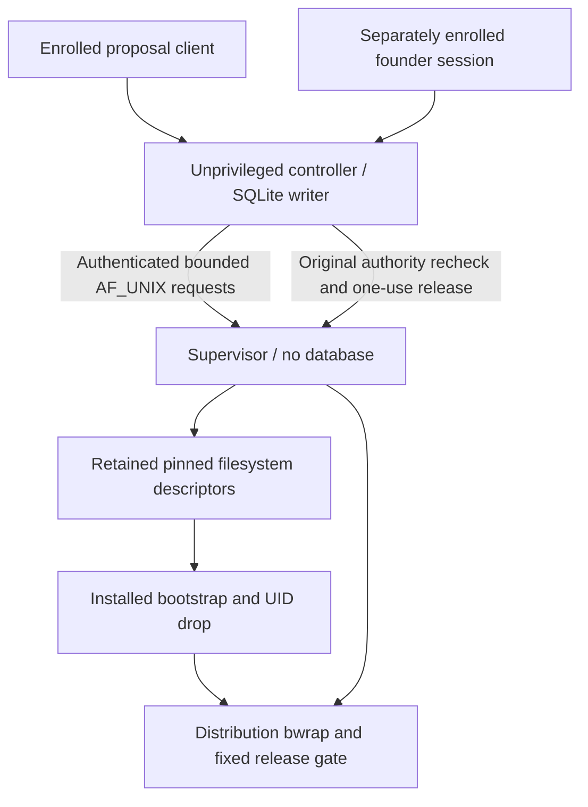

# Installed runtime adapters — M3 Block 3.5

This block supplies repository-side installed adapters. It does not install a
bundle, approve activation, provision accounts or establish host enforcement.
The founder's Codex workflow and application remain unchanged. Block 4 bundle
generation is a separate task.

## Fixed composition

`controller_entry.main()` selects `build_installed_controller_adapters()`;
`supervisor_entry.main()` selects `build_installed_supervisor_adapters()`.
There is no module-name, plugin, MCP, environment or command-line adapter loader.
The explicit `_io` argument exists for repository tests, which construct their
own objects; installed entrypoints never supply it.

The controller opens existing controller-owned SQLite through the existing
schema/integrity checks. It owns authorization, final recheck and durable state.
Its driver composes `DurableExecutionStore`, `Controller`, `ControllerRuntime`
and `RemoteProcessBackend`. Worker roots are represented by path-free filesystem
expectations; the controller performs no privileged inspection or UID switching.

The supervisor composes approved plans, `FilesystemInspector`,
`LinuxProcessBackend`, `CgroupV2`, the installed bootstrap and the existing sealed
release gate. It does not open or receive a controller registry. Logical root and
plan IDs select its own approved configuration. Wire messages cannot supply
executables, identities, mounts, flags, capabilities or environments.

## Installed configuration contract

**Superseded for installed startup by Block 3.75:** the per-start enrollment
contract is documented in [operational-enrollment.md](operational-enrollment.md).
Production now requires v3 attestation and static v2 component policy. The v2
attestation described below remains only for the earlier offline fixtures; it
cannot start the default installed adapters. Service session identity is learned
on the authenticated channel, not precomputed in the installation bundle.

The adapter activation attestation is an explicitly versioned v2 runtime contract
at `/etc/bonup-agent-control/approved-installation.json`. The existing v1
**non-activation installation validator remains unchanged**; a v1 manifest cannot
activate these adapters. Block 4 must incorporate the runtime contract into its
complete reviewed installation inventory. This block creates neither format on
the host and does not generate an approved manifest.

The closed activation contract binds provisioning generation 1, expected source
commit claim, a canonical attestation/bundle digest, the complete fixed installed
module/policy/wrapper hash inventory, identity-map digest, component configuration
digests and the immutable integration resource digest. Both `approved` and
`activation` must be exactly true for installed startup. Missing/extra dependencies,
unknown fields, changed digests and unapproved states deny startup. The commit
claim is a validated Git object ID bound into the root-approved attestation; it is
not a self-referential source-code constant. Block 4 must verify the exact source
commit when building/installing the reviewed bundle. Runtime verifies installed
file hashes without consulting a founder-writable Git checkout.

Each process loads the identity map, attestation and only its own component JSON.
The controller JSON contains its service enrollment, separate founder/model peer
enrollments, controller handshake and execution-to-plan/filesystem expectations.
The supervisor JSON contains its service enrollment, approved root catalog and
fixed launch plans. The configuration digest covers the service fields before
adding the verified manifest digest, avoiding a circular hash definition.

Boot, process-start and generation enrollment is explicit operational state.
Restart/reboot does not guess new peer identities, rediscover authority or replay
a release. Reenrollment/configuration approval and survivor reconciliation are
required before new admission. No daemon initializes a missing registry.

Installed code/artifacts and configuration are verified as root-controlled,
non-symlinked and not group/world writable. No installed adapter executes from a
writable checkout. Future wrappers must use isolated Python startup and the fixed
`/usr/lib/bonup-agent-control` package tree; Block 4 must inventory the bootstrap,
gate, wrappers, modules, policies and both component configuration files.

## Unix transport and sockets

Production uses AF_UNIX streams only. Kernel SO_PEERCRED and independent
boot/PID/start observations are compared with an enrolled endpoint/generation.
The handshake cannot claim founder authority. Enrollment reuse, malformed frames,
unknown fields, duplicate keys, bad UTF-8, partial-frame timeout and oversized
frames fail closed. No TCP fallback, SCM_RIGHTS or worker administrative channel
exists. A disconnected enrollment cannot reconnect automatically.

The installed listener adapter adopts **systemd-created socket descriptors**.
It validates the exact LISTEN_PID/FD count/names, endpoint pathname, socket type,
listening state and path ownership/mode. It does not create, chmod, chown or unlink
operational sockets. The future socket units must provide:

| Endpoint | Owner | Group | Mode | Enrolled peer |
| --- | --- | --- | --- | --- |
| `/run/bonup-agent-control/founder.sock` | 3000 | approved founder primary GID | 0660 | exact founder process |
| `/run/bonup-agent-control/proposals.sock` | 3000 | approved model-client primary GID | 0660 | exact proposal process |
| `/run/bonup-agent-supervisor/control.sock` | root | 3000 | 0660 | exact controller process |

Directory traversal policy must permit those peers without admitting workers;
socket modes never replace SO_PEERCRED/process enrollment. Supervisor-to-gate
communication remains a private inherited unnamed socketpair.

The controller RPC adapter has one normal request slot and one independent
heartbeat slot. Responses are correlated before delivery. Stream reads honor
length framing rather than assuming recv boundaries. RPC timeout closes the
connection; a lost release acknowledgement is never retransmitted. SQLite work
stays on the controller thread. Bounded PREPARE waits service authenticated founder
requests on that same thread: they can durably stop/revoke the launch before final
release, without issuing nested RPC. The existing final release transaction
serializes release versus a later revocation; it is bounded by the RPC timeout. Normal RPCs have a one-second response budget;
slow preparation fails closed rather than extending authority.

## Linux preparation and servicing

Only the supervisor's fixed work queue performs potentially blocking preparation.
The pinned interface has no pathname or legacy-plan fallback. The exact inspected
handles reach FD-based bwrap construction and remain owned by the inspector until
setup finishes or fails. Cancellation latches stop without closing an in-use pin;
the completing preparation path then closes it and cannot release payload.

Pinned launch uses `posix_spawn` for a fixed installed trusted bootstrap, avoiding
Python execution after fork in a multithreaded service. The bootstrap accepts only
a sealed supervisor-created memfd and waits for cgroup placement acknowledgment.
It clears descriptors/environment/groups, drops to the enrolled identity, drops
capabilities, establishes no_new_privs/rlimits and executes fixed `/usr/bin/bwrap`.
The gate receives another sealed configuration and one private release channel.
EOF or invalid/expired release cannot execute payload; gate and mount descriptors
are removed before payload exec.

The production backend is `LinuxProcessBackend` plus `CgroupV2`, never the synthetic
resource backend. Limits come from the approved integration profile. The cgroup
backend writes fixed memory/swap/PID/CPU settings, attaches the trusted bootstrap,
queries population, kills the entire launch and removes only an empty owned child.
Its path is the future delegated supervisor service subtree; live cgroup writes
are not performed by ordinary tests.

A separate BOOTTIME deadline thread services grant/lease/operation deadlines and
aggregate cgroup CPU budget, independently of request processing. Worker limits
cannot renew authority. Kernel timerfds are armed before child creation. Deadline
errors are observable and stop service admission; heartbeat and systemd watchdog
are additional liveness checks, not authority renewal. Termination has scheduling
latency and is not claimed to be instantaneous.

Output is retained up to the authorized per-stream bound, with explicit truncation
and bounded nonblocking draining. Cleanup remains uncertain until both child exit
and empty cgroup evidence exist. Terminal output metadata survives descriptor
cleanup. Failures leave durable state for reconciliation and cannot silently release
held resources or replay a launch.

The supervisor startup checks exact effective/permitted/bounding capabilities:
SETUID, SETGID, KILL and DAC_READ_SEARCH; inheritable/ambient capabilities are empty
and no_new_privs is required. Controller startup requires zero capabilities.
CAP_SYS_ADMIN and CAP_DAC_OVERRIDE are not selected.

The explicit notifier reads only systemd's notification socket and emits bounded
READY/WATCHDOG/STOPPING messages. Errors propagate; notification cannot authorize
operations. SIGTERM/SIGINT request controlled shutdown.

## Validation and remaining host proof

Focused tests exercise fixed factories, strict configuration, temporary Unix
transport, kernel peer validation, disposable SQLite lifecycle, pinned-plan
construction and the real one-use release parser. UID ownership observations,
privileged process execution, tmpfs and cgroup effects are explicitly substituted
inside test code. The tests neither require keys nor call OpenAI.

HOST_TEST_REQUIRED before activation: verified immutable installed imports,
socket-unit permissions and activation FDs, exact capability bounds, real UID/GID
and supplementary-group drop, cgroup delegation/controller availability,
posix_spawn/bootstrap placement, real bwrap/AppArmor transition, gate inside the
namespace, mount-FD lifetime, pidfd identity, pipe draining, whole-descendant kill,
tmpfs byte/inode bounds, systemd notification/watchdog, crash/disconnect cleanup
and reboot/reenrollment reconciliation. These are not claimed by synthetic tests.

No service, socket, account, cgroup, persistent runtime directory or installation
bundle is created by importing these modules or running their offline tests.

## Block 4 installed configuration

The default installed adapter now requires the closed v4 review-bundle manifest
and verified installation receipt. Legacy v2/v3 configuration remains available
only to explicitly injected offline fixtures. See [installation-bundle.md](installation-bundle.md)
for separate installation, integration-service and activation permissions.
Operational identity remains per-start; no PID/start/boot/generation is prepopulated.
