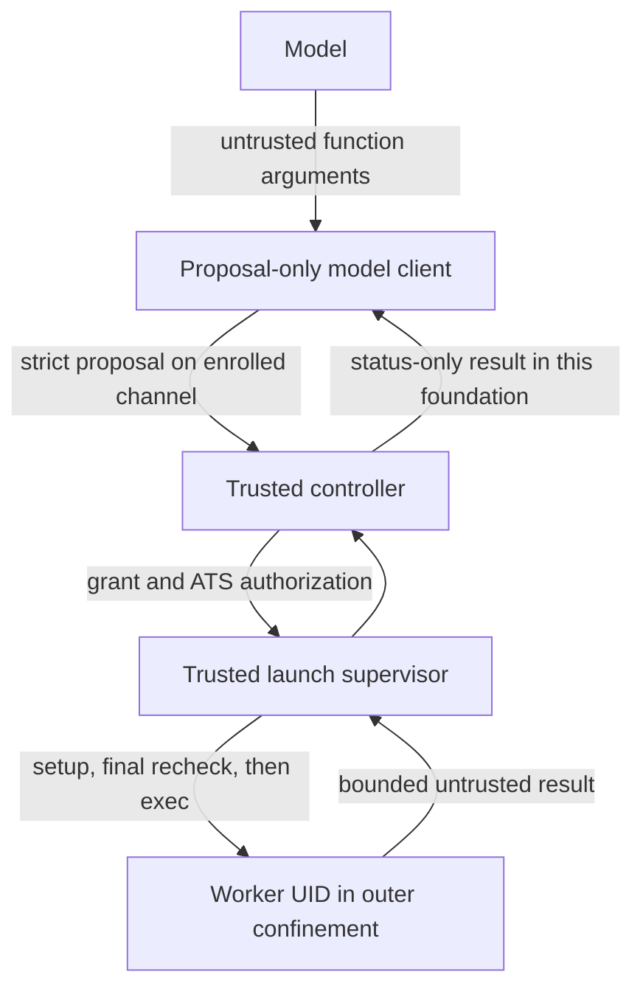

# Proposal-only routing foundation

Status: implemented offline foundation; not an activated agent runtime.

The founder approved this architecture for the managed 12-agent runtime. Phase I
still enables only the existing ARCH/FE/BE/QA policy definitions, and no identities
or agents are provisioned/activated by this implementation. The current founder
Codex/ChatGPT workflow and authentication remain unchanged.

## Implemented scope and explicit limits

- `protocol.py`: v1 proposals, duplicate/unknown-field rejection, UTF-8, 64 KiB
  messages, nesting depth 12, four-byte network-order framing and total frame
  deadlines. Parsing cannot execute anything.
- `identity.py`: SO_PEERCRED, current effective identity, process boot/start
  identity, separately enrolled founder context and worker mapping primitives.
  Root is not founder. Environment names do not authenticate anyone.
- `model_client.py`: deterministic fake model plus offline OpenAI request/response
  contract. **No network transport, SDK, key loader or automatic tool dispatcher.**
  `OpenAIProposalClient.propose` fails closed until separately implemented.
- `execution.py`: trusted store/enrollment interfaces, grant/task binding checks,
  active/revoked/expiry/fencing/reservation checks, bounded result records,
  one-use in-memory requests and synthetic supervision.
- `confinement.py`: immutable profile digest, explicit read/write exports, fixed
  bwrap argv, empty-derived environment, private HOME/TMP, isolated network/PID
  namespaces, capability drop, resource-limit declarations and Git modes.

`SyntheticLaunchSupervisor` is a **simulation**, not a working OS launcher. Its
EXEC trace marks simulated execution; it never spawns a process or applies a file
operation. Timeout/cancellation/output tests prove this abstraction's behavior,
not live process-tree termination. The previous host audit is independent
kernel-confinement evidence. No nested Codex sandbox is used.

Resource limits in the profile are declarations, not enforced by the argv builder.
The generated argv is for review/current-UID synthetic fixtures only. A production
supervisor must enforce limits, clear groups, switch UID/GID, close descriptors,
verify AppArmor/no_new_privs, establish setup barriers and use pidfds. It must hold
pinned mount descriptors through setup; **do not execute generated path-based argv
as a production launcher**. No CLI/daemon entry point exposes this foundation.

## Authority and operation policy

The model supplies only `version`, `request_id`, `execution_id`, `operation` and
operation-specific `arguments`. `execution_id` is a hint compared against the
controller-enrolled channel, not a bearer grant. Authority/role/UID/environment/
mount/profile/approval fields are rejected, including extra argument fields.

Operations are READ_FILE, LIST_DIRECTORY, SEARCH, WRITE_FILE, APPLY_PATCH,
RUN_TEST, RUN_COMMAND, GIT_STATUS, GIT_DIFF and GIT_COMMIT_LOCAL. Every operation
also requires an explicit controller-owned CommandPolicy. Unconfigured operations
are denied. RUN_COMMAND must match an exact enrolled argv; RUN_TEST names a
controller-owned command. Neither can select arbitrary host executables or shell
strings. A future file helper receives payload JSON on a bounded input pipe;
no payload is interpolated into trusted commands. APPLY_PATCH is restricted to a
single authorized path; implementing its patch helper remains future work.

The controller checks the enrolled process, grant, worker role, task/specification,
active/revoked state, expiry, current fence, process boot/start binding, workspace,
profile digest, reservations, protected paths, export scope and operation policy.
It checks again after setup, before simulated exec. Any failure prevents execution.
Replay IDs and launch records are one-use within the controller instance; production
requires durable replay/revocation state and a serialized transaction/lease protocol.

ExecutionStore, Enrollment and ExecutionBinding are **trusted controller inputs**.
They must never be deserialized from the model request. Python objects are not an
isolation boundary against hostile code in the controller interpreter. There is no
new registry/SQLite runtime adapter in this foundation; M1/M2 storage behavior is
unchanged. A future adapter must load current approvals, active reservation leases,
and revocation state transactionally rather than accepting a cached active set.

Founder access uses a separately enrolled process/interface. A model-client process
sharing founder UID cannot automatically access founder authority. Workers do not
receive either the founder interface or the model-client/control channel. Persistent
socket enrollment and production pidfd lifetime management are not implemented.

## Preparation-to-release authority continuity

The controller hashes the complete validated ExecutionGrant and Task records using
existing canonical JSON/SHA-256. This includes grant identity, scope, execution ID,
agent/role, branch, task/specification, process binding and absolute expiry without
maintaining a competing list of M1/M2 record fields. The same digest binds the
controller enrollment, worker UID/GID, execution process, pinned workspace identity,
repository identity, profile/environment, selected command policy, active reservations,
fence and active/revoked state. A controller-owned `authority_revision` must increase
on every authority transition, including revoke/restore, to detect change-and-restore.
A future store adapter must enforce this revision; it is not a model-supplied value.

The immutable launch record retains this digest and absolute expiry. The supervisor
passes the original prepared record to a controller-owned release callback after
setup and audit callbacks. The controller reloads and validates authority, reloads
again after filesystem inspection, and compares with the original authorization.
A newly valid replacement grant, fence, task, process, workspace or profile cannot
release an old prepared handle. Any failed release aborts the handle, with no retry
or unrestricted fallback. WORKER_STARTED remains a synthetic pre-release audit intent;
a subsequent denial means no simulated EXEC occurred.

Remaining lifetime is checked after validation and again at release. Zero/negative
lifetime denies execution; fractional seconds remain fractional. Release may reduce,
but never increase, the prepared timeout. The absolute deadline remains part of the
record; a future OS supervisor must enforce that deadline, not restart an old timeout
following scheduling or setup delays.

This is a synchronous synthetic release contract. No untrusted callback or setup
runs between the final gate and simulated EXEC. It is not an atomic OS exec/clock or
filesystem guarantee: production still requires a serialized authority transaction
through release, monotonic revision persistence, pinned mounts, and a supervised child
barrier/deadline. Those activation gates must not be replaced with polling checks.

Deterministic tests change valid grants/fences/specifications, workspace/repository
identities, profiles and processes during setup; test revoke/restore revisions;
expire authority before preparation, during validation/setup and before release;
and verify fractional deadlines, unchanged-authority success and handle cleanup.

## Filesystem, environment and Git

TaskRoot pins a directory descriptor and verifies device/inode/owner/group. Safe
opens walk descriptor-relative paths using O_NOFOLLOW and reject special files and
multiply linked regular files. Export inventory rejects links and protected names,
checks every descendant against the grant and is bounded to 4096 entries/depth 64.
The production supervisor must eliminate remaining pathname/mount TOCTOU races using
pinned descriptors and immutable sanitized snapshots. Mount namespaces remain the
outer backstop. Source export must not reuse authoritative-repository hardlinks.

Only `/usr` is accepted as a host runtime root. Founder-home roots are rejected.
This does not audit arbitrary files installed under `/usr`: a production runtime
image must be inventoried and sanitized. Private scratch HOME/TMP are intentional
writable exceptions to task source scope. No host service sockets are mounted.

Environment values are constructed from empty: PATH, HOME, USER, LOGNAME, LANG,
LC_ALL, TZ, TMPDIR and controlled PWD. USER/LOGNAME are labels, never identity.
No provider variables, SSH agent, loader variables, startup profiles or Git
credentials are inherited. Launch records allow no inherited sensitive descriptors
and prohibit shell mode. Actual descriptor closure is a production-supervisor gate.

Ordinary operations reject `.git` paths. Git operations must match the separately
recorded repository directory identity. A writable Git metadata profile is accepted
only for a separately permitted local-commit operation. Other operations use hidden
or read-only metadata. Production Git helpers must disable inherited config, hooks,
external diffs, remote helpers and signing; this foundation does not implement those
helpers or authorize push/merge/deployment.

## Audit

The shared AuditEvent/EventType vocabulary adds MODEL_PROPOSAL_RECEIVED,
OPERATION_AUTHORIZED, OPERATION_DENIED, CONFINEMENT_SETUP_STARTED,
CONFINEMENT_SETUP_FAILED, WORKER_STARTED and WORKER_EXITED.

The routing hook emits only event type, controller-created correlation ID and an
allowlisted reason code. It does not log argv, environment, model prose, file
contents or raw exception messages. Audit sink failure prevents further dispatch;
a production sink must durably append these events with independently verified
provenance into the existing chained audit model. Synthetic events do not claim
that a real worker was started. No new persistent event writer is enabled here.

## Minimal OpenAI contract (reviewed 2026-09-14)

The future transport targets the Responses API. Only application-defined function
tools are supplied, with `strict: true`, all properties required and
`additionalProperties: false`. The offered function set is the operation allowlist;
`tool_choice: required` and `parallel_tool_calls: false` request one proposal.
The controller still independently authorizes it. No hosted execution, shell,
computer/browser, MCP, file-search or web-search tools are exposed.

The offline adapter accepts a completed response containing exactly one
`function_call` plus optional reasoning items. It parses its JSON `arguments`
through the same strict operation validator. Unknown function names, malformed
arguments, non-function actions and multiple calls are denied. Controller-supplied
request/execution IDs are added locally. `function_call_output` uses the received
call_id and bounded status-only JSON. It does not execute a function automatically.
The protocol's integer-only JSON parser is intentionally conservative: future
transport must project/validate provider envelopes with fractional metadata without
relaxing the strict proposal parser. Refusals/incomplete responses remain no-exec.

An API credential belongs only to the trusted model-client service. It must never
enter controller proposals, worker roots, HOME, environment, result messages or
inherited descriptors. No credential object or key parameter is implemented here.
Credentials must not be printed, committed, embedded in argv or copied from the
founder's Codex authentication. SDK installation is not required for this foundation.

The official Python SDK documents two retries and a ten-minute timeout by default.
Future activation must explicitly choose bounded timeouts and disable automatic
retries initially (`max_retries=0`); a timeout is not proof that a request was never
processed. Model-response replay must never replay authorized worker execution.
No SDK defaults are used by the current offline implementation.

Sources:
- [Responses create](https://developers.openai.com/api/reference/cli/resources/responses/methods/create)
- [Function calling and strict tools](https://developers.openai.com/api/docs/guides/function-calling)
- [Python SDK timeout/retry behavior](https://developers.openai.com/api/reference/python)
- [API credential handling](https://developers.openai.com/api/docs/guides/production-best-practices)

Codex CLI is not the managed worker runtime: it has built-in execution paths, and
its nested sandbox is incompatible with the tested outer boundary. This decision
does not modify or restrict the founder's existing interactive Codex workflow.

## Separate activation gates

1. Review this offline foundation and implement transactional registry/enrollment
   wiring plus production file/Git helpers and supervisor barriers.
2. Review founder-controlled provisioning artifacts and rollback before creating
   any service/worker identities or directories.
3. Validate cross-UID isolation, pinned mounts, descriptor closure, quotas, timeout,
   cancellation, workspace/repository substitution and fail-closed crash recovery.
4. Separately approve a model-client identity, API account/key ownership, SDK or HTTP
   transport dependency, model/budget, sanitized context and bounded result policy.
5. Test transport with a local fake HTTP service before authorizing any live call.
6. Authorize live API use and agent activation separately. Do not infer either from
   passing offline tests. Milestone 4 is not part of these changes.
