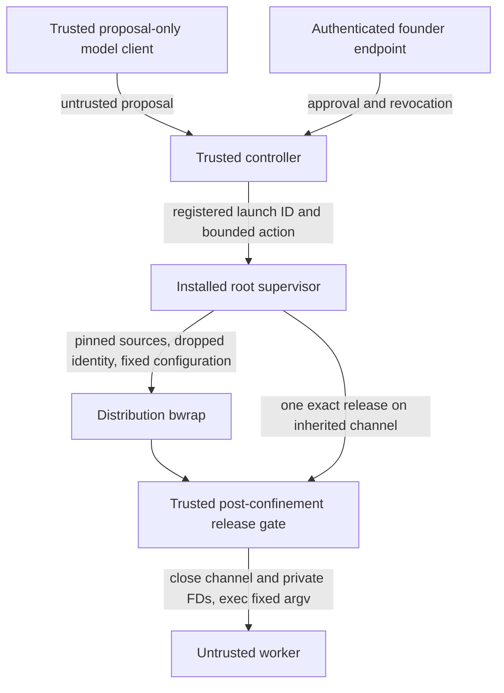

# Milestone 3 supervised execution foundation

This is repository code and review material, **not an installed or activated
runtime**. No operational registry is migrated automatically. The founder's
Codex/ChatGPT workflow is unchanged. Managed model reasoning remains proposal-only;
workers receive neither model credentials nor a credential-bearing model process.

## Durable control registry

`runtime_schema.migrate_v2(registry)` explicitly accepts v1 only. It uses one
`BEGIN IMMEDIATE` transaction, verifies the existing registry, adds the five tables
below, checks the expected schema, `integrity_check` and `foreign_key_check`, then
commits. Failure rolls back. Both source v1 and target v2 require the exact closed
table/index/trigger/view inventory and definitions, including SQLite autoindexes
and sequence tables. Only ANALYZE tables with definitions generated by the same
SQLite build are optional; arbitrary `sqlite_*` names are not exempt. Temporary
schema objects also block verification. Unsupported versions, partial additions,
extra objects and modified definitions block opening. Initialization still creates v1; migration
does not enroll or enable previous execution records. Existing grant/history rows
are retained byte-for-byte. Only disposable test registries have been migrated.

| Table | Meaning |
|---|---|
| `identity_enrollments` | Immutable agent/role/username/UID/GID/generation/approved manifest digest. Historical names and IDs are never silently reused. |
| `execution_profiles` | Immutable canonical confinement, environment and fixed command policy, addressed by digest. |
| `execution_runtime` | References the original immutable grant, enrollment and profile; mutable monotonic authority revision, revocation and fencing. |
| `launch_attempts` | Unique launch/request, original authorization digest/revision, supervisor generation, boot identity, cgroup, prepared process identity, deadline, state/revision and cleanup/exit reason. |
| `resource_leases` | Reservation identity, full canonical granted-resource record/digest, execution owner, fence, monotonic revision, expiry, revocation and held flag. Expiry/revocation alone never transfers ownership. |

Foreign keys, uniqueness constraints and explicit indexes supplement application
checks. Runtime transitions use compare-and-swap revisions. Relevant M1 task and
approval mutations advance associated runtime authority revisions, including
change-and-restore races. Original `ExecutionGrant` contents are not copied into
mutable runtime rows. The v2 founder-only grant method retains the existing immutable
grant representation and publication path; the v1 dormant metadata API remains
unchanged.

Resource leases require an already authorized, validated Reservation bound to the
execution and task. A unique held-resource index prevents different reservation IDs
from acquiring the same resource type/key concurrently. This foundation treats even
capacity reservations conservatively as exclusive; capacity allocation, production
resource naming and scheduling remain unimplemented. Revisions must advance on
every mutation; rows cannot be deleted to reset revision history. Release follows
confirmed cleanup, never expiry alone.

The corrective checkpoint changes the unpublished v2 definition. Earlier defective
v2 disposable databases are rejected, not silently upgraded or repaired. The only
supported migration remains trusted v1 to this v2. No operational registry has
been migrated; do not run this against a live database.

## State and authority continuity

The successful path is:

`REGISTERED → PREPARING → PREPARED → RELEASE_PENDING → RUNNING → STOPPING → TERMINAL`

Every nonterminal state except STOPPING can instead enter STOPPING. STOPPING can
enter TERMINAL only with positive cleanup evidence. No terminal state resumes.
Reasons are DENIED, SETUP_FAILED, EXITED, TIMEOUT, REVOKED, CANCELLED and INTERRUPTED.

The trusted controller supplies the existing complete authorization check through
`Supervisor.authorize`. `DurableExecutionStore` reconstructs its authoritative
binding from the registry and controller-pinned roots. A wire request never supplies
that callback, a grant, worker identity, command, mounts, environment or bwrap flags.
The immutable grant's process binding identifies the enrolled supervisor process;
each actual bootstrap PID/start identity is separate mutable launch evidence.

Preparation captures the original authorization digest, runtime authority revision,
profile, workspace identity, supervisor generation and boot. After confinement
readiness, authority is checked again. Release persists RELEASE_PENDING, holds the
SQLite writer transaction through the final exact launch-row/authority/deadline
check and release transmission, and then records RUNNING. A different valid grant
cannot authorize an older prepared handle. A failed or uncertain release is stopped,
never replayed. RUNNING means release was delivered and execution may have begun;
it is not an assertion that `execve` succeeded.

SQLite and process creation/exec are **not atomic**. Revocation ordered before
release denies it; revocation after release triggers whole-launch termination.
Neither instantaneous termination nor an atomic wall-clock check plus `execve` is
claimed. The gate rechecks expiry immediately before exec, and the independently
armed boot-time deadline plus supervision bounds running authority.

## Installed Linux bootstrap and release gate

The recommended owner is a root-owned systemd supervisor, with an unprivileged
controller and separate worker UIDs. `LinuxProcessBackend` refuses ordinary
unprivileged construction and requires verified installed artifact hashes and a
pinned root-owned cgroup-v2 subtree. It never falls back to an unrestricted command.

The bootstrap creates the private release channel, sealed configuration memfd,
output pipes and cgroup. A forked trusted child cannot proceed until its parent
attaches it to the cgroup. EOF on this pre-bootstrap pipe exits; this pipe does not
authorize worker execution. The child verifies the installed account, clears groups,
sets all GIDs and UIDs, clears environment and unwanted FDs, applies rlimits and
no_new_privs, verifies zero effective/permitted/inheritable/ambient host capabilities,
and execs fixed `/usr/bin/bwrap` arguments. No CAP_SYS_ADMIN is requested.

The installed gate runs with `python3 -I` inside bwrap. It verifies sealed config,
worker UID/GID/groups, distinct mount/PID/network namespaces, zero capabilities,
no_new_privs and the expected AppArmor domain before announcing readiness. It accepts
exactly one bounded versioned JSON release frame followed by end-of-write. EOF before
a complete frame, timeout, malformed/extra data, wrong launch/generation/digest/nonce
or expiry exits without payload execution. The release carries no executable or
authority parameters. The payload was fixed in sealed configuration before setup.

Host controller IPC authenticates `SO_PEERCRED` and enrolled PID/start/boot identity.
For the inherited gate socketpair, the bootstrap verifies peer credentials **before**
entering namespaces and seals the endpoint's device/inode identity. The gate verifies
that exact inherited endpoint; it does not compare host PIDs or UIDs with translated
namespace credentials. Only the trusted supervisor retains the sending endpoint.
The nonce has no authority on another socket or launch. The gate closes the channel
and configuration before executing untrusted code.

## Filesystems and descriptors

`TaskRoot` and `PinnedMounts` pin device/inode/owner identity. Linux `openat2` requires
RESOLVE_BENEATH, NO_SYMLINKS, NO_MAGICLINKS and NO_XDEV. Export inspection rejects
special files, regular-file hardlinks, prohibited components, excessive depth/count
and nested mounts. bwrap receives `--bind-fd`/`--ro-bind-fd`; it does not reopen
authorized workspace path strings. Each export is opened once, inspected through
that same retained descriptor, and passed to bwrap using that descriptor. Recursive
inspection opens children relative to the pinned parent; there is no inspect-close-
reopen window. Root-path identity checks may reject a renamed workspace; an export
rename cannot substitute a different object for the retained descriptor. The trusted runtime is read-only `/usr`; founder
home, controller state, host `/run`, systemd/Docker sockets, host `/sys` and service
credentials are absent. Private proc/dev, HOME/TMP and network/PID namespaces are
created. Generic production exports currently require hidden Git metadata; writable
Git metadata requires a separately reviewed sanitized Git helper.

Pinning prevents path substitution, not concurrent edits to an inode. Installation
must provide exclusive sanitized workspace ownership, immutable root ancestors and
controller-held leases; no source hardlinks to the authoritative checkout. Installed
host tests must exercise substitution during preparation and actual FD-bind behavior.

CLOEXEC is the default. The single-threaded fork bootstrap uses explicit FD allowlists
and `close_range`; unsupported closure fails. The gate prunes bootstrap/mount FDs,
then before payload exec allows only stdin/stdout/stderr and verifies `/proc/self/fd`.
These are `/dev/null` and bounded output pipes, not founder terminal or service FDs.

## Supervision, deadlines and recovery

Each launch has a UUID cgroup under the supervisor's delegated subtree. Limits cover
CPU bandwidth, memory, zero swap, PIDs, CPU time, file size, FD count and disabled core
dumps. HOME/TMP sizes are bounded. Output is capped; excess triggers termination.
A finite **total workspace storage allocation remains an installation prerequisite**;
RLIMIT_FSIZE does not provide a disk quota.

A CLOCK_BOOTTIME timerfd is armed before setup. The gate receives the absolute
boot-time deadline as well as UTC expiry. The effective deadline is the earliest of
grant expiry, operation/profile timeout and **every required lease expiry**. Full
lease records, including revision, owner, resource and fence, enter the original
authorization digest and registered launch binding. Final release compares those
exact records; replacement or revoke/restore cannot authorize old preparation.
Controller authorization anchors elapsed deadlines before slow validation and
preserves them across rechecks and new requests using the same lease. The supervisor
cannot re-arm beyond that original elapsed deadline. Clock rollback cannot extend
the elapsed budget; restart never resumes uncertain launches. Required-lease expiry
or revocation while running stops the whole launch and retains ownership until
cleanup. `run_supervisor_loop` services deadlines and polls authority independently of
controller requests, with systemd watchdog supervision. A timerfd signals readiness;
it does not itself kill a process. The installed event loop and watchdog are required
parts of enforcement and must be tested together. Timeout, cancellation, revocation,
controller loss and authority replacement persist STOPPING, kill the entire cgroup
and pinned bootstrap process, and wait for cgroup emptiness and process reaping.
Reservations remain held until cleanup is confirmed. Parent descriptors and empty
per-launch cgroups are finalized before recording TERMINAL.

On startup, all nonterminal attempts are interrupted, never resumed. Unknown children
in the supervisor-owned subtree are killed and reconciled before admission. Changed
boot IDs, supervisor generations, PREPARED crashes, lost acknowledgements and uncertain
RELEASE_PENDING rows cannot become automatic execution. Missing/stale process evidence
does not establish cleanup. Database failure invokes independent OS cleanup; service
death is additionally covered by bwrap parent-death handling and systemd control-group
termination. Installed crash tests remain mandatory.

## Review artifacts, tests and remaining integration

See [provisioning review and rollback](provisioning/REVIEW-AND-ROLLBACK.md).
`review_manifest()` generates file hashes and unresolved account/service/storage
values in memory. It is not an installer. The unit template is deliberately not
deployable without reviewed values. Nothing executes checkout code as root.

Unit tests use disposable SQLite/Git fixtures, synthetic authority/process/cgroup
state and harmless unprivileged children. They test migration rollback and integrity,
CAS/state transitions, enrollment collisions, release denial cases, inherited FD
closure, mount rejection, deadlines, revocation, cleanup and crash reconciliation.
They do not exercise real cross-UID launches, live cgroups or installed systemd.

Before provisioning approval: review and complete the installed controller/IPC/event
loop composition, account allocation, exact capability bound, runtime artifact bundle,
workspace storage policy and separately gated privileged integration harness. Verify
the complete bwrap/AppArmor/gate path under those settings, including controller and
supervisor crash tests. Do not change the repaired AppArmor profile or enable nested
Codex. No live API transport, worker activation or Milestone 4 scheduling is included.

Runtime bookkeeping uses the existing private maintenance-operation journal without
raw command/environment/content payloads. It does not invent founder attribution or
claim that this journal replaces the existing chained M1 audit/publication history.
